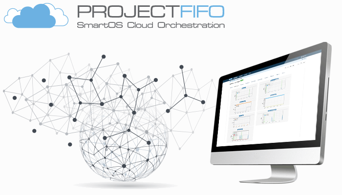

.. Project-FiFo documentation master file, created by
   Heinz N. Gies on Fri Aug 15 03:25:49 2014.

.. warning::

   This manual is for the **development** (aka beta) version of FiFo if you are not 100% certain that is what you want and are aware that things might not work please use the stable version (v: stable) in the lower left corner.

Welcome to Project-FiFo documentation!
======================================

Project FiFo is an open-source Cloud Management and Orchestration system for `SmartOS <https://smartos.org>`_ virtualisation environments. The components of FiFo are written entirely in Erlang which gives the suite excellent stability and fault recovery as it continues maturing to a production quality release.

Current Release "Ancy Airedale" (0.6.1)
---------------------------------------

Fifo Releases
-------------
The project has 2 installable versions - Current **Release** and a **Development** release. The development release changes daily and is only recommended for people who are not afraid to tinker under the hood and get their hands dirty.

Our Eco-System
--------------
We are **community** driven and as such have a open and **very friendly** eco-system, we encourage community engagement, contribution and feedback. Please join us and get involved by giving us new feature ideas or helping out with code or Documentation.

Most of the folks who develop and use fifo hang out on Freenode IRC in the **#project-fifo** channel. Why not come join us and say hi and meet the team?

* `Bug Tracker <http://jira.project-fifo.net/>`_
* `FiFo mailing list <https://groups.google.com/forum/?fromgroups#!forum/project-fifo>`_
* `twitter @project_fifo <https://twitter.com/project_fifo>`_
* `Google+ <https://plus.google.com/+ProjectfifoNetHome>`_
* `FiFo on Github <https://github.com/project-fifo>`_

Documentation
-------------

Further documentation can be found in the sections related to the part of the project or the general as a starting point of for non application specific topics.

.. toctree::
   :hidden:
   :maxdepth: 3

   general.rst
   sniffle.rst
   snarl.rst
   howl.rst
   wiggle.rst
   chunter.rst
   jingles.rst
   technical.rst
   troubleshooting.rst
