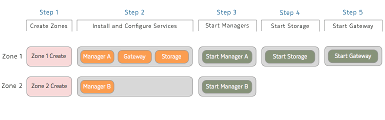

.. Project-FiFo documentation master file, created by
   Mark Slatem on 17th May 2015.

************
Installation
************

We are setting up 2 LeoFS zones with the following ip addresses and services. The FiFo Zone will be created seperately by following the regular installation guide - but is included in the table for clarity. For the purposes of this guide we will assume you only have 1 hypervisor (physical server). For production use, the recommended setup is a distributed LeoFS cluster - deployed on 5 separate servers across 5 different zones.

Our setup will be as follows:

+-----------------+-------------+----------------------------------------+---------------+
| Zone Name       |  IP Address |  Services                              |  Hypervisor   |
+=================+=============+========================================+===============+
| LeoFS Zone 1    |  10.1.1.21  |  Manager0, Gateway0, Storage0          |  1            |
+-----------------+-------------+----------------------------------------+---------------+
| LeoFS Zone 2    |  10.1.1.22  |  Manager1                              |  1            |
+-----------------+-------------+----------------------------------------+---------------+
| FiFo Zone       |  10.1.1.23  |  Sniffle, Snarl, Howl, Wiggle, Jingles |  1            |
+-----------------+-------------+----------------------------------------+---------------+

The ``storage.s3.host`` will always be the ip address of the zone where the "Gateway" service resides.

We will also need to generate a random cookie to be used as part of the setup.

.. code-block:: text

   [root@1.leofs ~]# openssl rand -base64 32 | fold -w16 | head -n1
   QvTnSK0vrCohKMkw

+---------------------+------------------------+
| Our Random Cookie   |  **QvTnSK0vrCohKMkw**  |
+---------------------+------------------------+

DNS Setup
------------------

LeoFS provides an S3 compatible API and as such requires a resolvable **Host Name** or **FQDN** to function. Both a DNS server or adding entries to ``/etc/hosts`` files will work. Using naked IP Addresses will **NOT** work.

A good alternative for test systems is the internet DNS service `XIP.io <http://xip.io>`_. It resolves hostnames in the form of: ``*.<io>.xip.io`` to ``<ip>``. xip.io is a special domain name that provides wildcard DNS
for any IP address. In this guide we will XIP.IO but for production it is recommended that you do not rely on any third party dns service or create a dependency on an external DNS service for your Cloud storage to function.

If our LeoFS storage zone IP is ``10.1.1.21`` using ``storage.10.1.1.21.xip.io`` as a hostname for the storage server will resolve and return the ip address 10.1.1.21.

.. code-block:: text

    [root@1.leofs ~]# dig @8.8.8.8 storage.10.1.1.21.xip.io

    ; <<>> DiG 9.8.3-P1 <<>> @8.8.8.8 storage.10.1.1.21.xip.io
    ; (1 server found)
    ;; global options: +cmd
    ;; Got answer:
    ;; ->>HEADER<<- opcode: QUERY, status: NOERROR, id: 16337
    ;; flags: qr rd ra; QUERY: 1, ANSWER: 1, AUTHORITY: 0, ADDITIONAL: 0

    ;; QUESTION SECTION:
    ;storage.10.1.1.21.xip.io.  IN  A

    ;; ANSWER SECTION:
    storage.10.1.1.21.xip.io. 300 IN  A 10.1.1.21

    ;; Query time: 303 msec
    ;; SERVER: 8.8.8.8#53(8.8.8.8)
    ;; WHEN: Mon Jun  1 20:41:48 2015
    ;; MSG SIZE  rcvd: 58    

.. note::  If your setup uses **internal DNS** or **host file** entries - then all the LeoFS service host names should be resolvable within each LeoFS zones as well as from the **Global Zone** of every hypervisor.

Installation Steps Overview
---------------------------

(Step 1) Create Zones
---------------------

From the *GZ (Global Zone)* we install the base dataset which we will use for our *LeoFS Zones*. Then we have to confirm it is installed:

.. code-block:: bash

   imgadm update
   imgadm import d34c301e-10c3-11e4-9b79-5f67ca448df0

If installed successfully you should see:

.. code-block:: bash

   d34c301e-10c3-11e4-9b79-5f67ca448df0  base64        14.2.0    smartos  2014-07-21T10:43:17Z

Sample contents of ``leo-zone1.json``

.. code-block:: json

   {
    "autoboot": true,
    "brand": "joyent",
    "image_uuid": "d34c301e-10c3-11e4-9b79-5f67ca448df0",
    "max_physical_memory": 1024,
    "cpu_cap": 100,
    "alias": "1.leofs",
    "quota": "80",
    "resolvers": [
     "8.8.8.8",
     "8.8.4.4"
    ],
    "nics": [
     {
      "interface": "net0",
      "nic_tag": "admin",
      "ip": "10.1.1.21",
      "gateway": "10.1.1.1",
      "netmask": "255.255.255.0"
     }
    ]
   }

Sample contents of ``setup-leo-zone2.json``

.. code-block:: json

   {
    "autoboot": true,
    "brand": "joyent",
    "image_uuid": "d34c301e-10c3-11e4-9b79-5f67ca448df0",
    "max_physical_memory": 512,
    "cpu_cap": 100,
    "alias": "2.leofs",
    "quota": "20",
    "resolvers": [
     "8.8.8.8",
     "8.8.4.4"
    ],
    "nics": [
     {
      "interface": "net0",
      "nic_tag": "admin",
      "ip": "10.1.1.22",
      "gateway": "10.1.1.1",
      "netmask": "255.255.255.0"
     }
    ]
   }

Next we create our *LeoFS JSON* payload files and create our 2 LeoFS zones.

.. code-block:: bash

   cd /opt
   vi leo-zone1.json
   vi leo-zone2.json
   vmadm create -f leo-zone1.json
   vmadm create -f leo-zone2.json

The rest of the setup will be done within our newly created LeoFS zones.

(Step 2.1) Zone 1 Configuration
-------------------------------

We zlogin to the **LeoFS Zone 1** and add the FiFo package repository then install the LeoFS **"Manager", "Gateway" and "Storage"** services.

.. code-block:: bash

   zlogin <leo-zone1-uuid>
   VERSION=rel
   cp /opt/local/etc/pkgin/repositories.conf /opt/local/etc/pkgin/repositories.conf.original
   echo "http://release.project-fifo.net/pkg/${VERSION}/" >> /opt/local/etc/pkgin/repositories.conf
   pkgin -fy up
   pkgin install leo_manager leo_gateway leo_storage

.. warning:: LeoFS uses ``Replicas`` to ensure a certain consistency level for your data. Once the replica value has been set in the below configuration files and your cluster started, it can **NOT** be changed. You can still add storage nodes to the cluster but your resiliency level will always remain constant.

Next we configure all the services in Zone 1 by editing each respective configuration file and changing the following settings:

leo_manager.conf
################

``vi /opt/local/leo_manager/etc/leo_manager.conf``   

.. code-block:: bash

   nodename = manager0@10.1.1.21
   distributed_cookie = QvTnSK0vrCohKMkw
   manager.mode = master
   manager.partner = manager1@10.1.1.22
   consistency.num_of_replicas = 1
   consistency.write = 1
   consistency.read = 1
   consistency.delete = 1

leo_gateway.conf
################

``vi /opt/local/leo_gateway/etc/leo_gateway.conf``

.. code-block:: bash

   distributed_cookie = QvTnSK0vrCohKMkw
   managers = [manager0@10.1.1.21, manager1@10.1.1.22]
   http.port = 80
   http.ssl_port     = 443

leo_storage.conf
################

``vi /opt/local/leo_storage/etc/leo_storage.conf``

.. code-block:: bash

   distributed_cookie = QvTnSK0vrCohKMkw
   managers = [manager0@10.1.1.21, manager1@10.1.1.22]

(Step 2.2) Zone 2 Configuration
-------------------------------

We now zlogin to the **LeoFS Zone 2** and add the FiFo package repository then install the LeoFS **"Manager"** service.

.. code-block:: bash

   zlogin <leo-zone1-uuid>
   VERSION=rel
   cp /opt/local/etc/pkgin/repositories.conf /opt/local/etc/pkgin/repositories.conf.original
   echo "http://release.project-fifo.net/pkg/${VERSION}/" >> /opt/local/etc/pkgin/repositories.conf
   pkgin -fy up
   pkgin install leo_manager   

leo_manager.conf 
################

``vi /opt/local/leo_manager/etc/leo_manager.conf``   

.. code-block:: bash

   nodename = manager1@10.1.1.22
   distributed_cookie = QvTnSK0vrCohKMkw
   manager.mode = slave
   manager.partner = manager0@10.1.1.21
   consistency.num_of_replicas = 1
   consistency.write = 1
   consistency.read = 1
   consistency.delete = 1   

(Step 3.1) Start Manager A
---------------------------
Zlogin to Zone 1 and enable the following services.

.. code-block:: bash

   svcadm enable epmd
   svcadm enable leofs/manager
   leofs-adm status

(Step 3.2) Start Manager B
---------------------------
Zlogin to Zone 2 and enable the following services.

.. code-block:: bash

   svcadm enable epmd
   svcadm enable leofs/manager
   leofs-adm status

Please be aware that the startup order is **very** important and that the ``leofs-adm status`` commands should show the service is up on **BOTH** zones before you continue.    

(Step 4) Start Storage
----------------------

Zlogin to Zone 1 and enable the LeoFS Storage service and confirm it is running.

.. code-block:: bash

   svcadm enable leofs/storage
   leofs-adm status

Confirm that when running ``leofs-adm status`` the storage is listed. Once confirmed you then **start** the storage with the ``leofs-adm start`` command.

.. code-block:: bash

   leofs-adm start  

(Step 5) Start the Gateway
--------------------------

Zlogin to Zone 1 and enable the LeoFS Gateway service and confirm everything is running correctly.

.. code-block:: bash

   svcadm enable leofs/gateway
   leofs-adm status   

Starting the LeoFS Cluster
--------------------------

First we ZLOGIN into the LeoFS Zone 1 and run the following command ``leofs-adm status`` to ensure there is no errors/problems related with "mnesia".

Next we generate a unique password for fifo to access the LeoFs storage.

.. code-block:: text

   [root@1.leofs ~]# openssl rand -base64 32 | fold -w16 | head -n1
   qypdpQ47e/E4oKH3

+-----------------------------+------------------------+
| Our FiFo S3 user password   |  **qypdpQ47e/E4oKH3**  |
+-----------------------------+------------------------+

Lastly we start the cluster, add the endpoint and our fifo user.

.. code-block:: bash

   [root@1.leofs ~]# leofs-adm add-endpoint 10.1.1.21.xip.io
   [root@1.leofs ~]# leofs-adm create-user fifo qypdpQ47e/E4oKH3

   access-key-id: ed4528b19bc043770c12
   secret-access-key: 18b35c2dc5b0819e31d7c2fece24add0ef9ec221

Next we create our 3 buckets using our ``access-key-id``

.. code-block:: bash

   [root@1.leofs ~]# leofs-adm add-bucket fifo ed4528b19bc043770c12
   [root@1.leofs ~]# leofs-adm add-bucket fifo-images ed4528b19bc043770c12
   [root@1.leofs ~]# leofs-adm add-bucket fifo-snapshots ed4528b19bc043770c12

.. note::  Do **NOT** lose your **access-key-id** and **secret-access-key** as you will need them later to complete your FiFo setup.

Thats it your LeoFS setup is complete, you can now return to the FiFo installation manual and continue with the rest of your FiFo setup.

