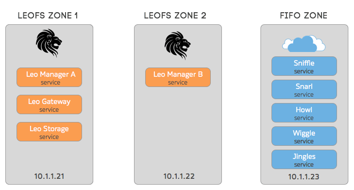

.. Project-FiFo documentation master file, created by
   Mark Slatem on 7th May 2015.

***********
Overview
***********

This guide will **NOT** attempt to be a comprehensive document that covers every possible installation scenario. Instead it will cover a basic, best-practice bare-minimum setup that is considered sane for a basic deployment.

As part of the LeoFS setup, we will be creating 2 dedicated zones. in each zone we will install specific LeoFS packages and configure each service. It is recommended that you get your LeoFS zones up and running first, then continue with the FiFo setup as per the `installation manual <../general/installation.html>`_.
