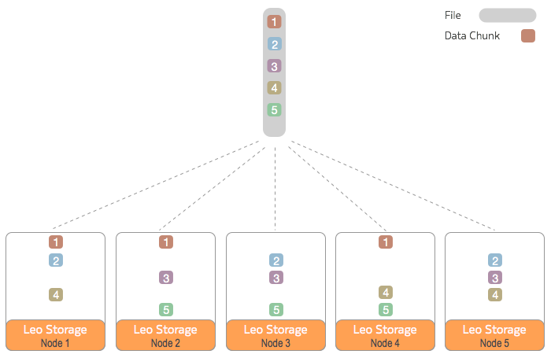

.. Project-FiFo documentation master file, created by
   Mark Slatem on 7th May 2015.

***********
Overview
***********

This guide will **NOT** attempt to be a comprehensive document that covers every possible installation scenario. Instead it will cover a basic, best-practice bare-minimum setup that is considered sane for a basic deployment.

.. image:: ../_static/images/leofs_services_overview.png

As part of the LeoFS setup, we will be creating 2 dedicated zones. in each zone we will install specific LeoFS packages and configure each service. It is recommended that you get your LeoFS zones up and running first, then continue with the FiFo setup as per the `installation manual <../general/installation.html>`_.

A LeoFS Cluster can be thought of as elastic storage and as such, can stretch and grow as needed. LeoFS consists of **3 services** that depend on Erlang.

+------------------+-----------------------------------------------------------+
| `LeoFS Gateway`_ | Handles http requests and responses from clients.         |
+------------------+-----------------------------------------------------------+
| `LeoFS Storage`_ | Handles GET, PUT and DELETE objects as well as metadata.  |
+------------------+-----------------------------------------------------------+
| `LeoFS Manager`_ | Monitors the LeoFS Gateway and the LeoFS Storage nodes.   |
+------------------+-----------------------------------------------------------+

The storage node is where your data physically resides. In production environments it is recommended that you have multiple storage nodes distributed across multiple physical servers. In addition you should set your `consistency level`_ and number of **Replicas** to values that match the high availability levels that you require. 

It is **very important** to understand that it is your **configured** consistency levels that dictate fault tolerance and high availability and has **nothing** to do with the the **number** of storage nodes you have. Once your consistency levels have been defined and your storage cluster started, they **CAN NOT** be changed - so please design for this accordingly.  

To further illustrate this point, in the below example diagram, we have 5 LeoFS storage nodes with the cluster configured for a consistency level of **N=3** write replicas. This ensures that 3 copies of all data exists at all times.

.. _LeoFS Gateway: http://leo-project.net/leofs/docs/architecture/leofs-gateway-detail.html

.. _LeoFS Storage: http://leo-project.net/leofs/docs/architecture/leofs-storage-detail.html

.. _LeoFS Manager: http://leo-project.net/leofs/docs/architecture/leofs-manager-detail.html

.. _consistency level: http://leo-project.net/leofs/docs/configuration/configuration_1.html#system-configuration-label
